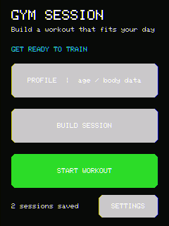
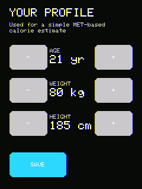
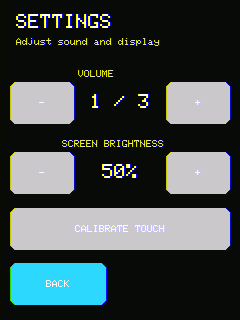
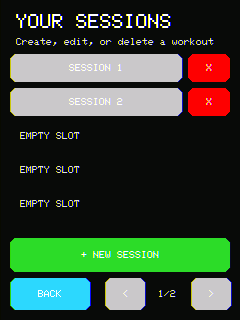
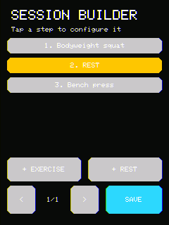
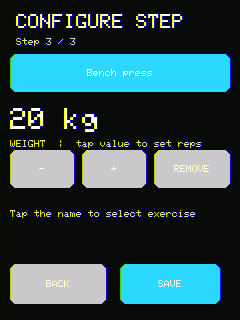
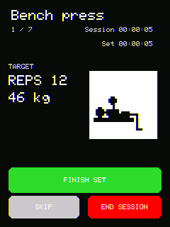
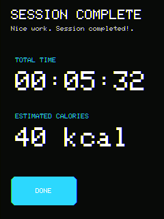
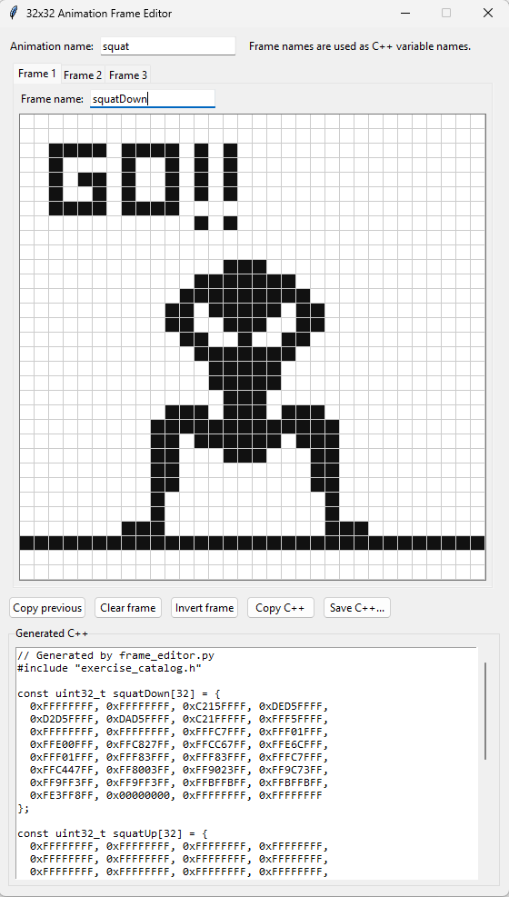

# Gym Session

A compact workout tracker for the CYD2USB version of the ESP32 Cheap Yellow Display. Build a workout on the touchscreen, run it with animated exercise prompts and audio cues, then review the session summary.

Only a few demo exercises have been included, have fun creating your own :D

Development of this project was AI-assisted.



## At a glance

- Create and edit workouts directly on the 240x320 touchscreen.
- Combine repetition-based exercises with timed exercises and rest steps.
- Track elapsed time and estimate calories from the user's profile and exercise MET values.
- Store up to 10 workouts in ESP32 NVS using `Preferences`.
- Adjust volume, screen brightness, and touch calibration from the Settings screen.
- Capture an screenshot to the SD card with the ESP32 BOOT button (GPIO 0).

## User flow

### 1. Set up your profile

Enter age, body weight, and height. These values are global and are used by the session calorie estimate.



### 2. Configure the device

Settings provides volume and brightness controls, plus the four-point touch calibration workflow. Calibration values are stored in NVS and reused after reboot.



### 3. Choose or create a workout

Workouts use numbered slots rather than custom names. From the session browser you can create a new slot, edit an existing one, delete it, or select it for immediate use.



### 4. Build the session

Add exercises or rest steps. The builder displays six steps per page, and tapping a step opens its configuration screen.



Exercises can be configured for repetitions and, where supported, a load in kilograms. Timed exercises and rests use seconds.



### 5. Run the workout

The active screen shows the current step, target value, elapsed session time, animation, and controls for finishing, skipping, or ending the session. Timed steps count down and provide a rising beep sequence during the final 10 seconds.



### 6. Review the result

After the final step, the summary shows total elapsed time and the MET-based calorie estimate.



## Hardware and controls

The sketch targets the CYD2USB board and uses the following connections:

| Function | GPIO |
| --- | ---: |
| LCD backlight | 21 |
| Buzzer / DAC amplifier path | 26 |
| Touch MOSI | 32 |
| Touch MISO | 39 |
| Touch clock | 25 |
| Touch chip select | 33 |
| BOOT button / screenshot trigger | 0 |
| SD chip select | 5 |
| SD MOSI | 23 |
| SD MISO | 19 |
| SD clock | 18 |

Press the BOOT button after startup to save the current display as the next available file: `/cap_1.bmp`, `/cap_2.bmp`, and so on. The sketch temporarily switches the shared SPI bus to the SD pins and restores the touch bus after the capture.

## Implementation notes

- Beeps use the ESP32 built-in I2S DAC on the CYD GPIO26 amplifier path; no external I2S clock pins are claimed.
- Exercise animations use up to three 32x32, 1-bit frames.
- Session data, profile values, and device settings are stored in ESP32 NVS (`Preferences`). Older 12-step and 50-step session records are upgraded when loaded.

## Project layout

- `gym-session.ino` contains the application, screens, input handling, audio, persistence, and SD capture.
- `exercise_catalog.cpp` and `exercise_catalog.h` define exercises and their animation data.
- `frame_editor/` contains the standalone animation authoring tool.
- `docs/img/` contains device screenshots and editor documentation images.

## Adding an exercise

Exercise definitions and animation data live in `exercise_catalog.cpp`; the public types and helpers are in `exercise_catalog.h`.

1. Add up to three frame arrays to `exercise_catalog.cpp`. Each frame is a 32-row bitmap stored as 32-bit row masks; omitted rows are initialized to zero.
2. Create an `Animation32` descriptor with exactly three frame pointers or fewer, plus its frame duration in milliseconds.
3. Append an `ExerciseDef` entry with the name, `REPS` or `TIME`, MET value, default repetitions/seconds, default load, and animation pointer.

For example:

```cpp
const uint32_t newExerciseFrame[32] = {
	0x00030000, 0x00030000, 0x0007E000
};
const Animation32 newExerciseAnimation = {
	{newExerciseFrame, newExerciseFrame, newExerciseFrame}, 1, 400
};
```

The step editor lets every exercise change its primary value (repetitions or seconds) and load in kilograms.

## Animation frame editor

The `frame_editor` folder contains a standalone Python/Tkinter tool for creating the 32x32 animation frames used by exercises. It supports up to three frames and can copy or save the generated C++ output for use in `exercise_catalog.cpp`.

Run it from the `frame_editor` folder with:

```powershell
python frame_editor.py
```

The tool uses only the Python standard library. See `frame_editor/README.md` for the editor controls and animation output details.


